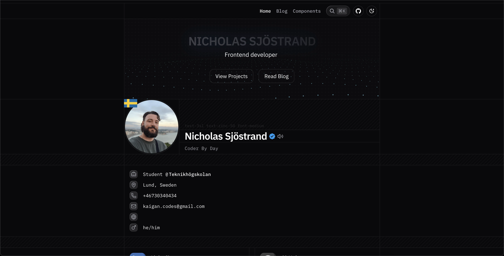

# Kaigan Portfolio

A minimal portfolio and blog to showcase my work as a developer.

Check out the live site: [kaigan.dev](https://kaigan.dev)



> Tip: swap the preview image above if you customize the look and feel.

## Overview

### Highlights

- ✅ Built with Next.js 15, Tailwind CSS v4, TypeScript, and shadcn/ui
- 🎯 Production-ready defaults for SEO, analytics, and accessibility
- 🧱 Component registry to quickly showcase reusable UI pieces
- 📰 MDX-powered blog with RSS feed and syntax highlighting
- 📱 PWA support with install prompts and offline caching
- 🌗 Theme-aware design with carefully tuned motion states

## Getting Started

### Requirements

- Node.js 20+
- pnpm 9+

### Setup

```bash
# Install dependencies
pnpm install

# Start development server
pnpm dev
```

The app starts at http://localhost:1408.

To target your own deployment domain, update the values in `src/config/site.ts`, `next.config.ts`, and the files under `public/icons/`.

```bash
pnpm build
pnpm start
```

## Deployment

Vercel is the quickest route—just import the repo and add the environment variables from `.env.example`. For other hosts, run `pnpm build` and serve the output of `.next` with any Node-compatible platform.

## Customisation Checklist

Use this when adapting the template:

1. Replace profile data in `src/features/profile/data/*`.
2. Update branding assets in `public/icons/` (see [branding guide](docs/BRANDING.md)).
3. Tailor analytics/social metadata in `src/app/layout.tsx`.
4. Refresh registry content via `pnpm run build:registry`.

## Development

### Available Scripts

```bash
pnpm lint      # Static analysis
pnpm test      # Run component tests (if configured)
pnpm format    # Format with Prettier
```

## License

Licensed under the MIT License. Feel free to fork and iterate—just remember to replace personal details with your own branding.

## Acknowledgements

Powered by React, Next.js, Tailwind CSS, Radix UI, Motion, shadcn/ui, Lucide, and the rest of the open-source packages listed in `package.json`.
